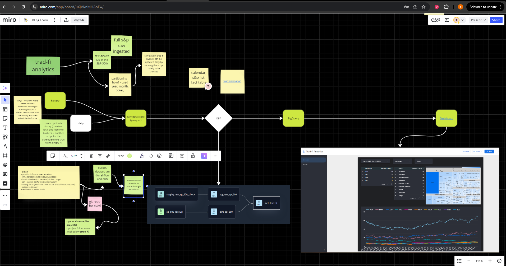

**Project Overview**


[**Set up Infrastructure**](https://github.com/Otobi1/trad-fi-analytics/blob/master/terraform/main.tf)
```
terraform init
terraform plan
terraform apply 
terraform destroy *(at the end of the project)*
```

[**Ingest Data into GCS**](https://github.com/Otobi1/trad-fi-analytics/blob/master/Scripts/check.py)
> * Ingest partitioned data for the S & P tickers into GCS. 
> * First for the history, in this case starting from 1991-01-01 and afterwards for a specific month

```
python3 check.py
python3 month.py
```

[**Transform Data with DBT**](https://github.com/Otobi1/trad-fi-analytics/tree/master/trad_fi_analytics)
> * Model data
> * Implement necessary column transformations for data type conversions 
> * Create connection between dimension and fact table 
> * Write data to Bigquery

[**Visualize Looker Studio Dashboard**](https://lookerstudio.google.com/reporting/fe89916d-4ae1-43af-ab59-a5ae0e003995/page/k1DFE)

**Limitations**
> * Ingestion script is manually triggered.
> * Transformations and publishing to Bigquery also manually triggered.
> * Using a task scheduler or orchestrator such as self hosted or managed airflow (AWS, GCP Composer etc.,)  would improve the overall usability.